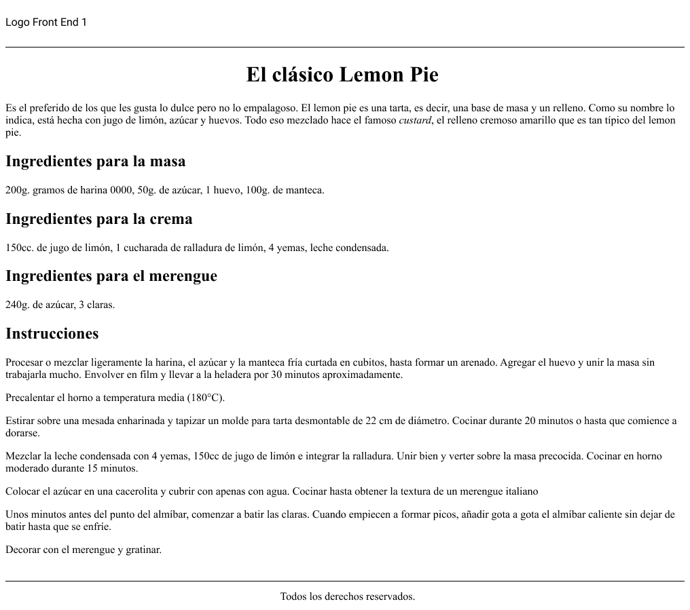
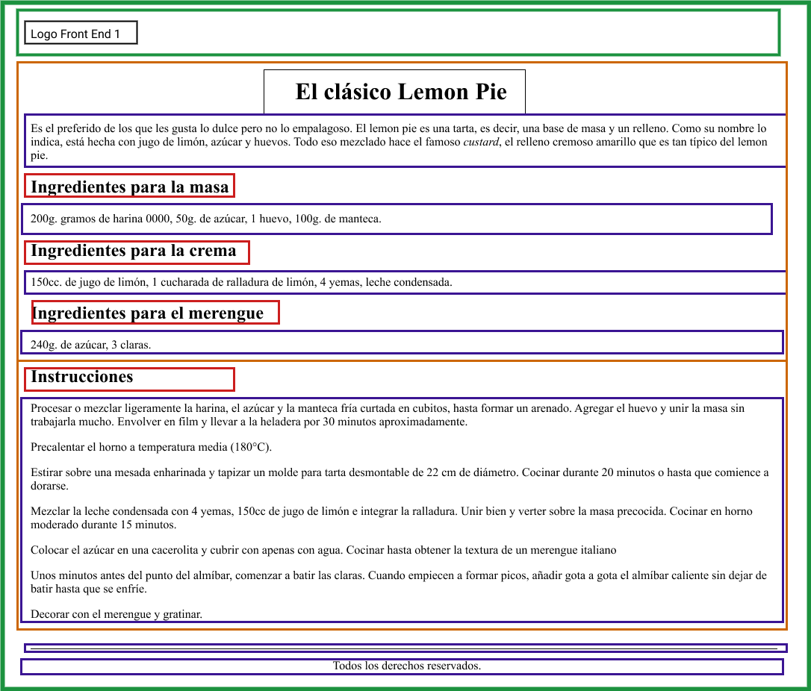

# Clase 4: Convertir el diseño realizado en Figma en una maqueta 
>*mayo 15*
----------
## Objetivos 
Una de las principales tareas de un desarrollador front-end es estructurar interfaces a
partir de un wireframe o una imagen. El desafío será reconocer las diferentes etiquetas
que podrían conformar el maquetado y comenzar a estructurar un archivo hasta obtener
un resultado visual similar a la referencia.
¡Buena suerte!✨

## Desafío
Utilizando este diseño de figma como fuente de datos, la idea será reconocer cuáles
podrían ser los diferentes elementos o etiquetas que corresponden a ese resultado visual.
Una vez hecho esto, tu tarea será trasladar aquello que idearon utilizando etiquetas
HTML.
**Importante:** El proceso de reconocer las diferentes etiquetas o elementos puede ser por
fuera del código. Es decir, pueden tomar nota en papel, escribiendo por encima de la
imagen si es que la imprimen o simplemente utilizando algún software para poder escribir o
dibujar sobre la imagen.
### Para finalizar
Antes de concentrarnos en el código, un ejercicio interesante es comprender cuáles serán
los elementos que necesitaremos para estructurar un sitio. Esto nos dará la posibilidad de
tomar decisiones fáciles de modificar ya que, una vez hecho esto, el proceso de
estructurar HTML será solo insertar etiquetas con sus valores correspondientes.

----------
>$C5$ $EQUIPO$ $1$
## Design

## Box

