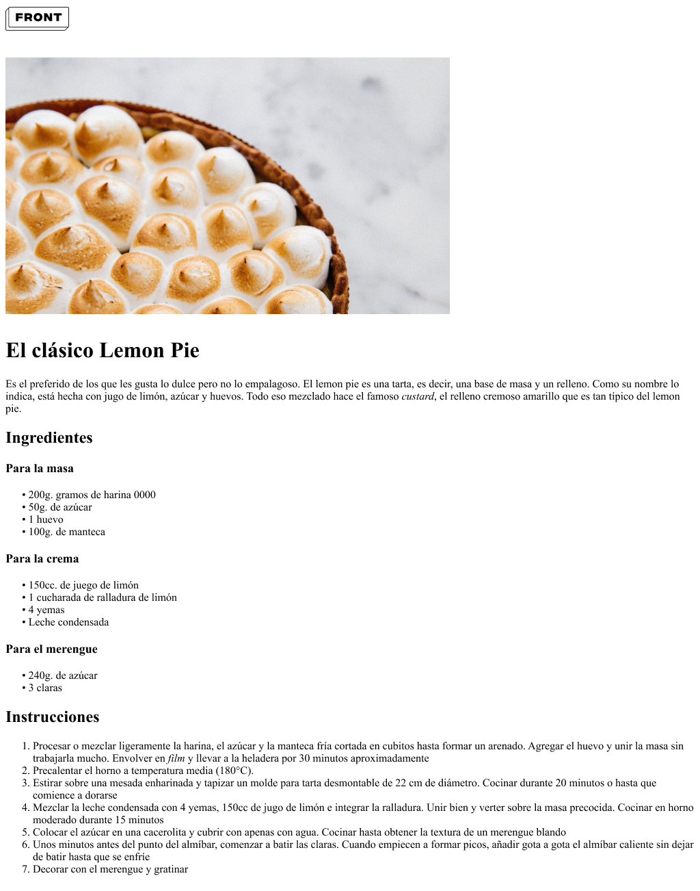
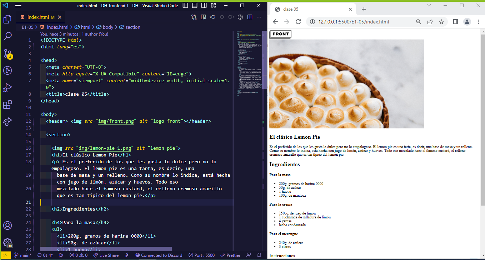

# Clase 5: Momento de maquetado 
>*mayo 17*
----------
## Objetivos 
Una de las principales tareas de un desarrollador front end es estructurar interfaces a
partir de un wireframe o una imagen. El desafío será reconocer las diferentes etiquetas
que podrían conformar el maquetado y comenzar a estructurar un archivo hasta obtener
un resultado visual similar a la referencia.
¡Buena suerte!✨

## Desafío
Utilizando del siguiente figma, la idea será reconocer cuáles podrían ser los diferentes
elementos o etiquetas que corresponden a ese resultado visual. Una vez hecho esto,
su tarea será trasladar aquello que idearon utilizando etiquetas HTML.

**Importante:** El proceso de reconocer las diferentes etiquetas o elementos puede ser por
fuera del código. Es decir, pueden tomar nota en papel, escribiendo por encima de la
imagen si es que la imprimís o simplemente utilizando algún software para poder escribir o
dibujar sobre la imagen.

### Para finalizar
Antes de concentrarnos en el código, un ejercicio interesante es comprender cuáles serán
los elementos que necesitaremos para estructurar un sitio. Esto nos dará la posibilidad de
tomar decisiones fáciles de modificar, ya que, una vez hecho esto, el proceso de
estructurar HTML será solo insertar etiquetas con sus valores correspondientes.

----------
>$C5$ $EQUIPO$ $1$
## Design

## Finish

<!--  -->