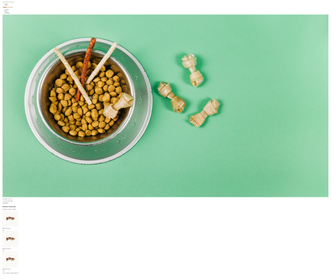
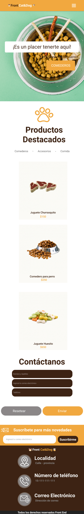

# Clase 6: Momento de maquetado 
>*mayo 19*
----------
## Objetivos 
Una de las principales tareas de un desarrollador front end es estructurar interfaces a
partir de un wireframe o una imagen. El desafío será reconocer las diferentes etiquetas
que podrían conformar el maquetado y comenzar a estructurar un archivo hasta obtener
un resultado visual similar a la referencia.
En esta y las siguientes clases integradoras trabajaremos sobre un proyecto cuyo
resultado final será el presentado en el siguiente figma.
¡No te asustes! iremos gradualmente hasta conseguir el resultado deseado.
¡Buena suerte! 😎👍✨

## Desafío
Dados los siguientes datos, maquetar el HTML incluyendo en el <body> una estructura
semántica y utilizando los conceptos conocidos hasta ahora. Se pueden extraer las
imágenes del mismo documento figma.

### Contenido para la cabecera:
Barra superior
- Grandes ofertas en comederos
- Menú regional
  - Español
  - $ARG

Barra de menú principal
- Imagen logo
- Menú principal
  - Categorías
  - Pets
  - Nosotros
  - Contactanos

### Contenido para el área principal:

Sección banner
>Imagen background
>¡Es un placer tenerte aquí!
>¡Comederos en descuento!
>COMEDEROS

Sección productos
>Imagen patita
>Productos Destacados
>Comederos - Accesorios - Comida

>Imagen producto 1
>Juguete Churrasquito
>$150

>Imagen producto 2
>Juguete Churrasquito
>$150

>Imagen producto 1
>Juguete Churrasquito
>$150

### Contenido para el pie de página:
Todos los derechos reservados Front End

### Conclusión
Una vez realizada la maqueta, debería quedarte algo similar a esto:

----------
>$C5$ $EQUIPO$ $1$

## Design
>

## Finish

<!--  -->

<!--  -->
## Full Desktop
>

## Full Mobile
>

