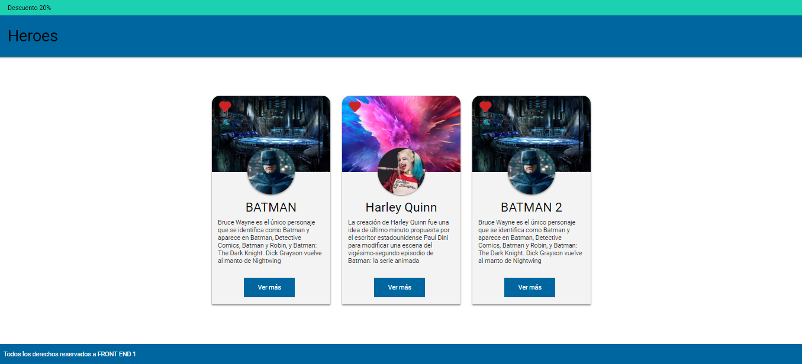

# Clase 10: Momento de maquetado 
>*mayo 29*
----------
## Objetivos 
Una de las principales tareas de un desarrollador Front End es tanto estructurar
interfaces como aplicar estilos a partir de un wireframe o una imagen. El desafío será
reconocer las diferentes etiquetas y los correspondientes estilos que podrían conformar
el maquetado y diseño para comenzar a estructurar un archivo hasta obtener un
resultado visual similar a la referencia.
En esta oportunidad utilizaremos una herramienta llamada Figma de donde podremos
obtener toda la información necesaria para realizar el maquetado.
¡Buena suerte!😎👍✨

## Desafío
Utilizando el diseño desarrollado en Figma, disponible en el siguiente enlace, la idea será
revisar los diferentes elementos y estilos que corresponden a ese resultado visual y
maquetarlo.
Por el momento usaremos las propiedades del modelo de caja vistas en clase para poder
maquetarlo. La barra azul del Header deberá quedar fija en la parte superior al hacer
scroll en la página..

### Conclusión
Antes de concentrarnos en el código, un ejercicio interesante es comprender cuáles serán los elementos que necesitaremos para estructurar un sitio. Ésto nos dará la posibilidad de tomar decisiones fáciles de modificar ya que, una vez hecho esto, el proceso de estructurar HTML será solo insertar etiquetas con sus valores correspondientes.

Una vez realizada la maqueta, debería quedarte algo similar a esto:

----------
>$C5$ $EQUIPO$ $1$

## Design
>

## Finish

<!--  -->
## Full Desktop
<!-- > -->
>##
## Full Mobile
>##
<!-- > -->

