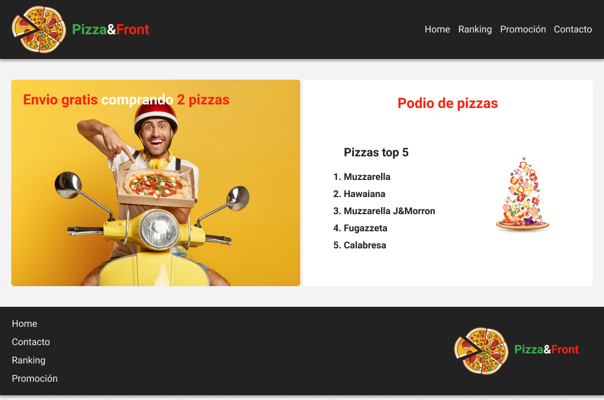

# Clase 11:  Flexbox 
>*mayo 31*
----------
## Objetivos 
Una de las principales tareas de un desarrollador Front End es tanto estructurar interfaces como aplicar estilos a partir de un wireframe o una imagen. El desafío será reconocer las diferentes etiquetas y los correspondientes estilos que podrían conformar el maquetado y diseño para comenzar a estructurar un archivo hasta obtener un resultado visual similar a la referencia.

En esta oportunidad utilizaremos una herramienta llamada Figma de donde podremos obtener toda la información necesaria para realizar el maquetado.
¡Buena suerte!😎👍✨

## Desafío
El boceto de figma mencionado anteriormente, lo utilizaremos para maquetar un sitio para una pizzería siguiendo los siguientes pasos:

- Reconocimiento de los elementos HTML en el boceto.
- Crear en VSC  las carpetas necesarias para el proyecto.
- Crear la estructura básica y semántica de HTML.
- Utilizar las etiquetas anteriormente reconocidas.
- Dar estilos en el archivo CSS.
- Implementar flexbox para el layout.

Una vez completada la actividad, compartir el enlace de GitHub Pages en Discord en el canal general.

### Conclusión
Antes de concentrarnos en el código, un ejercicio interesante es comprender cuáles serán los elementos que necesitaremos para estructurar un sitio. Esto nos dará la posibilidad de tomar decisiones fáciles de modificar, ya que, una vez hecho esto, el proceso de estructurar HTML será solo insertar etiquetas con sus valores correspondientes. Pensemos también qué reglas CSS podemos utilizar para lograr el resultado deseado.

Una vez realizada la maqueta, debería quedarte algo similar a esto:

----------
>$C5$ $EQUIPO$ $11$

## Design
>

## Finish

<!--  -->
## Full Desktop
<!-- > -->
>##
## Full Mobile
>##
<!-- > -->

